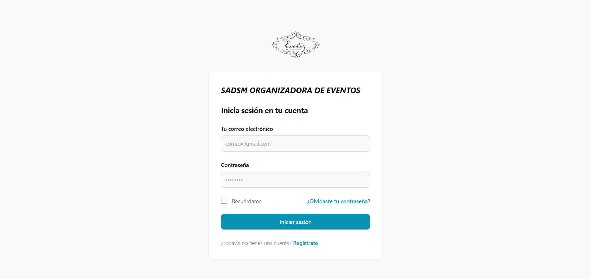
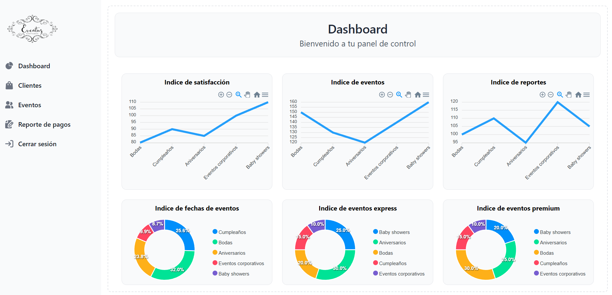
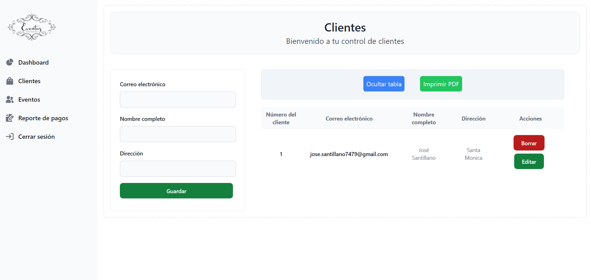
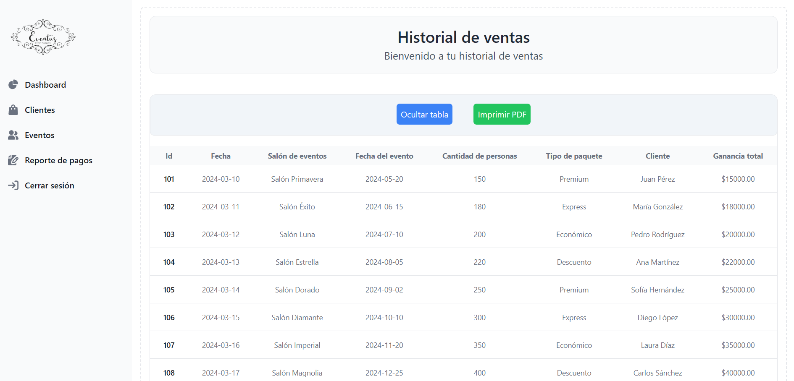
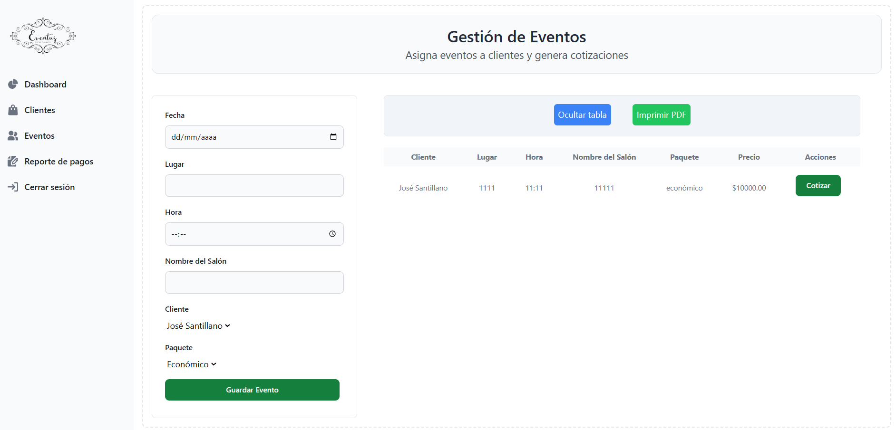

# Aplicacion de control de negocio de eventos
### Creado con React, Tailwind, y SweetAlert
Aplicacion desarrollada con React solamente con el Front-End, esto como practica de un proyecto escolar.

## Recursos
El proyecto esta creado con las siguientes tecnologías y APIs.

| Plugin                | URL                      |
|-----------------------|--------------------------|
| Tailwind         | https://tailwindcss.com/ |
| Flowbite       | https://flowbite.com/ |
| FontAwesome               | https://fontawesome.com/ |
| Google Fonts          | https://fonts.google.com/ |

## Imagenes

Login

Dashboard

Clientes

Eventos

Reporte de pagos

